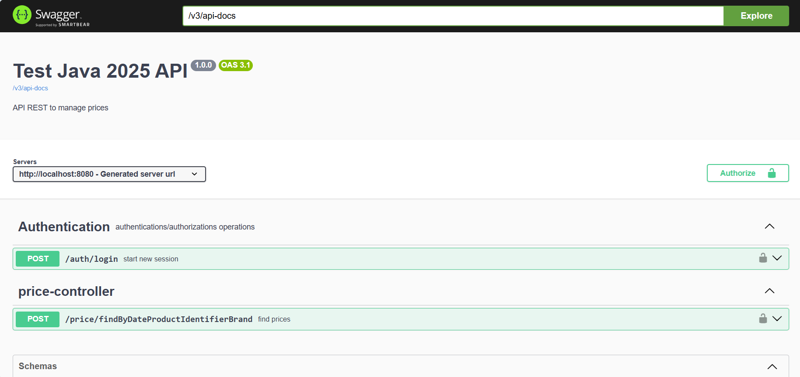
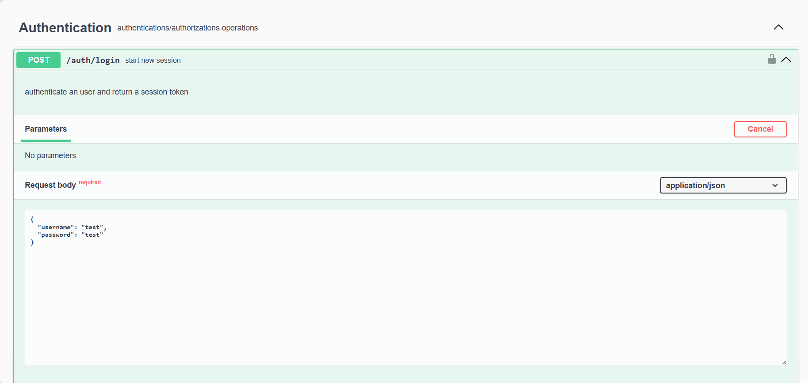
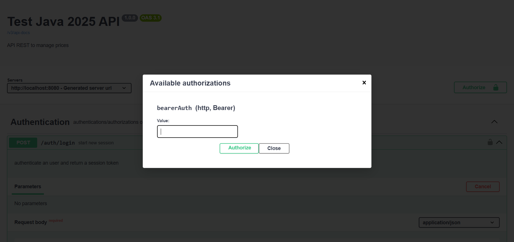
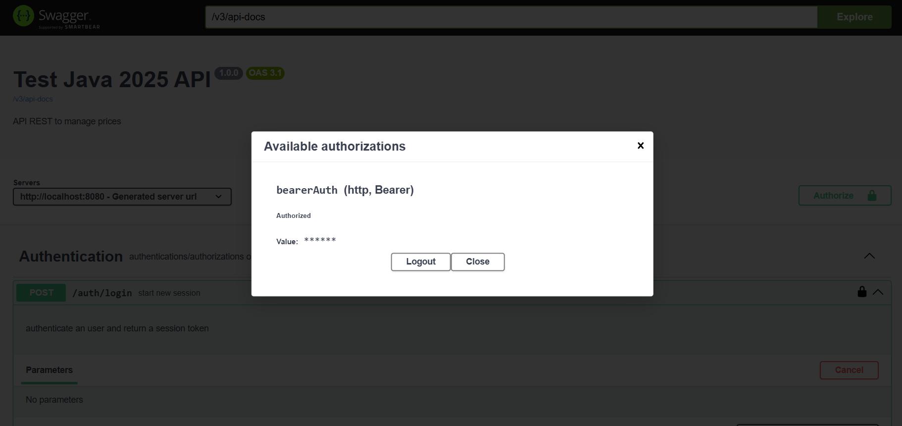
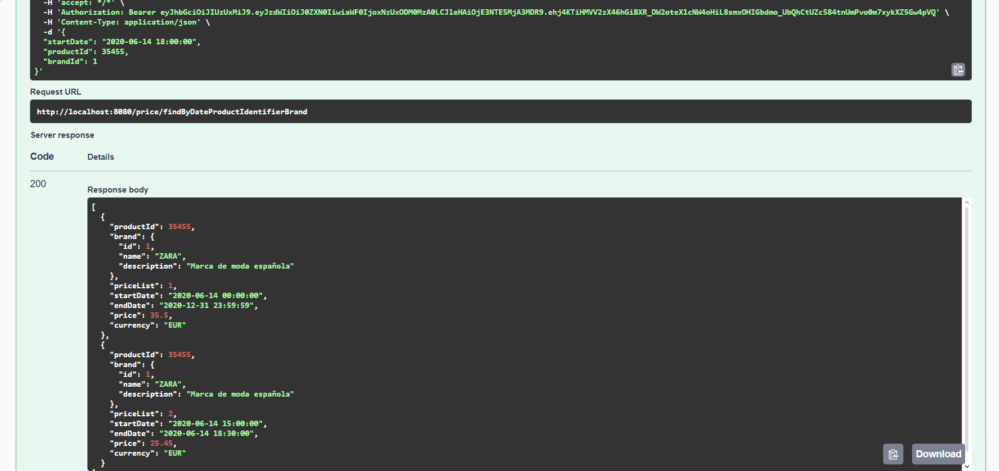

# Test Java 2025 - Price Management API

A Spring Boot REST API for managing product prices with JWT authentication, built using hexagonal architecture.

## Table of Contents

- [Overview](#overview)
- [Architecture](#architecture)
- [Technologies](#technologies)
- [Project Structure](#project-structure)
- [Getting Started](#getting-started)
- [API Documentation](#api-documentation)
- [Authentication](#authentication)
- [Usage Examples](#usage-examples)
- [Database Schema](#database-schema)

## Overview

This project is a REST API that manages product prices for different brands. It provides secure endpoints to search for prices based on date, product ID, and brand ID. The API uses JWT tokens for authentication and follows clean architecture principles.

### Key Features

- JWT-based authentication
- Price search by date, product, and brand
- Hexagonal architecture implementation
- Interactive API documentation with Swagger
- Custom password encoding with SHA-256
- Comprehensive error handling

## Architecture

The project follows **Hexagonal Architecture** (Ports and Adapters) pattern:

```
├── adapters/           # External interfaces (Controllers, DTOs, Config)
├── domain/            # Business logic and rules
└── infrastructure/    # Data persistence and external services
```

### Layers Description

- **Adapters**: REST controllers, DTOs, security configuration, and mappers
- **Domain**: Use cases, business models, ports, and domain services
- **Infrastructure**: JPA entities, repositories, and database adapters

## Technologies

- **Java 17+**
- **Spring Boot 3.x**
- **Spring Security** with JWT
- **Spring Data JPA**
- **MapStruct** for object mapping
- **Swagger/OpenAPI 3** for API documentation
- **H2 Database** (in-memory)
- **Maven** for dependency management

## Project Structure

```
src/main/java/com/bcncgroup/testjava2025/
├── adapters/
│   ├── config/                 # Security and Swagger configuration
│   ├── controller/             # REST endpoints
│   ├── dto/                    # Data Transfer Objects
│   └── mapper/                 # DTO mappers
├── domain/
│   ├── application/            # Use case implementations
│   ├── constant/               # Domain constants
│   ├── exception/              # Custom exceptions
│   ├── manager/                # Domain managers (password)
│   ├── model/                  # Domain models
│   └── ports/                  # Input/Output ports
└── infrastructure/
    ├── adapter/                # Repository adapters
    ├── conf/                   # Persistence configuration
    ├── entity/                 # JPA entities
    ├── mapper/                 # Entity mappers
    └── repository/             # JPA repositories
```

## Getting Started

### Prerequisites

- Java 17 or higher
- Maven 3.6+
- Eclipse IDE (recommended)

### Building and Running

#### For Eclipse IDE Development

Due to MapStruct annotation processing, you need to compile before running:

```bash
mvn clean compile
```

#### Building the Project

To create the JAR file:

```bash
mvn clean package
```

The JAR file will be generated in `adapters/target/` directory.

#### Running the Application

```bash
java -jar adapters/target/test-java-2025.jar
```

Or run directly with Maven:

```bash
mvn spring-boot:run
```

The application will start on `http://localhost:8080`

### Configuration

The application uses the following default configuration:

- **Port**: 8080
- **Database**: H2 in-memory
- **JWT Secret**: Configured via `jwt.secret` property
- **JWT Expiration**: 24 hours (86400 seconds)

## API Documentation

The API documentation is available through Swagger UI once the application is running:

**Swagger UI**: http://localhost:8080/swagger-ui/index.html



### Available Endpoints

| Method | Endpoint | Description | Authentication |
|--------|----------|-------------|---------------|
| POST | `/auth/login` | User authentication | No |
| POST | `/price/findByDateProductIdentifierBrand` | Find prices by criteria | Yes |

## Authentication

The API uses JWT (JSON Web Token) for authentication.

### Login Process

1. **Send login request** to `/auth/login`
2. **Receive JWT token** in response
3. **Use token** in Authorization header for protected endpoints

### Step 1: Login Request

**Endpoint**: `POST /auth/login`

**Request Body**:
```json
{
  "username": "test",
  "password": "test"
}
```



**Response**:
```json
{
  "jwt": "eyJhbGciOiJIUzI1NiJ9...",
  "username": "test"
}
```

### Step 2: Authorization Setup

Copy the JWT token from the login response and use it to authorize in Swagger:

1. Click the **"Authorize"** button in Swagger UI
2. Enter: `your-jwt-token-here`
3. Click **"Authorize"**



### Step 3: Making Authenticated Requests

Now you can call protected endpoints. The token will be automatically included in requests.



## Usage Examples

### Find Prices Example

**Endpoint**: `POST /price/findByDateProductIdentifierBrand`

**Request**:
```json
{
  "startDate": "2020-06-14 18:00:00",
  "productId": 35455,
  "brandId": 1
}
```

**Response**:
```json
[
  {
    "productId": 35455,
    "brand": {
      "id": 1,
      "name": "ZARA",
      "description": "Spanish fashion brand"
    },
    "priceList": 1,
    "startDate": "2020-06-14 15:00:00",
    "endDate": "2020-06-14 18:30:00",
    "price": 25.45,
    "currency": "EUR"
  }
]
```



### Error Responses

#### Validation Error
```json
{
  "errors": [
    {
      "startDate": "price.startDate.null"
    }
  ]
}
```

#### Authentication Error
```json
{
  "cause": "invalid.credentials",
  "code": 401
}
```

## Database Schema

The application uses an H2 in-memory database with the following tables:

### BRANDS Table
| Column | Type | Description |
|--------|------|-------------|
| ID | BIGINT | Primary key |
| NAME | VARCHAR(100) | Brand name |
| DESCRIPTION | VARCHAR | Brand description |

### PRICES Table
| Column | Type | Description |
|--------|------|-------------|
| ID | BIGINT | Primary key |
| BRAND_ID | BIGINT | Foreign key to BRANDS |
| START_DATE | TIMESTAMP | Price valid from |
| END_DATE | TIMESTAMP | Price valid until |
| PRICE_LIST | INTEGER | Price list identifier |
| PRODUCT_ID | BIGINT | Product identifier |
| PRIORITY | INTEGER | Price priority |
| PRICE | DECIMAL(10,2) | Price amount |
| CURR | VARCHAR(3) | Currency code |

### USERS Table
| Column | Type | Description |
|--------|------|-------------|
| USERNAME | VARCHAR | Primary key |
| PASSWORD | VARCHAR | Encrypted password |

## Security Features

- **JWT Authentication**: Stateless authentication using JSON Web Tokens
- **Password Encryption**: Custom SHA-256 with salt implementation
- **Request Validation**: Input validation with custom error messages
- **CORS Support**: Configurable cross-origin resource sharing

## Development Notes

- The project uses **MapStruct** for automatic object mapping
- **Clean Architecture** principles are followed throughout the codebase
- **Domain-Driven Design** patterns are implemented
- **Exception handling** is centralized with custom error responses

---

*For more information about the API, visit the Swagger documentation at `/swagger-ui/index.html` when the application is running.*